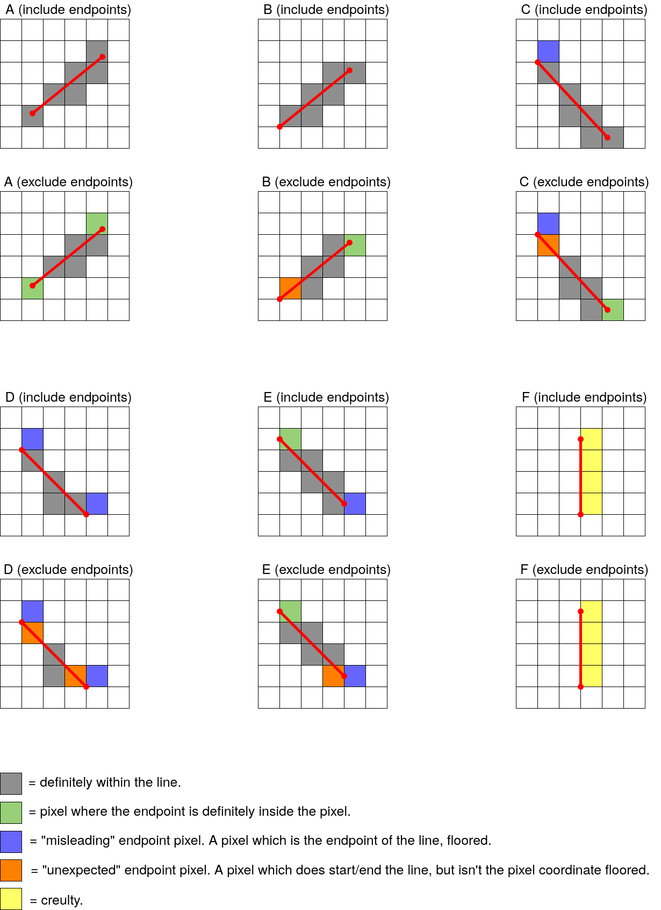
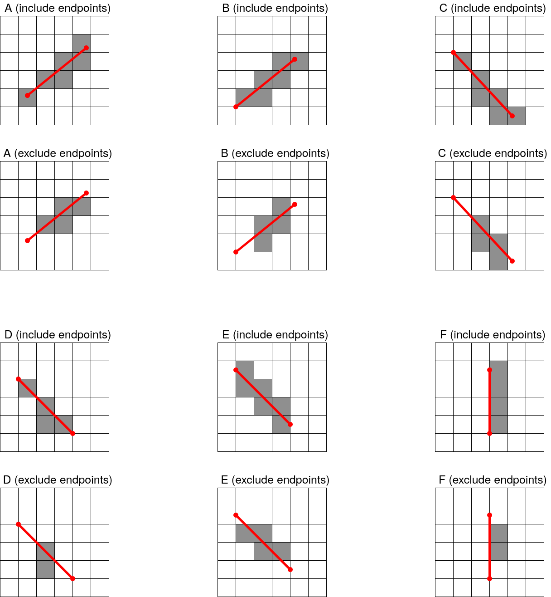

SubPixelLine
============
This is a small project which provides functions for drawing a line to a bitmap, but where the endpoints on the line are "real" values instead of the discrete pixel coordinates.

*Not actually ran with Bresenham's algorithm, I'm just showing the problem where some pixels rasterized miss the line.

Rasterizing a line with sub-pixel endpoints probably won't make much sense for a graphics library, unless doing anti-aliasing, but then you probably need a line thickness. My use case is actually for traversing a data structure, like a quadtree. When traversing a quadtree (to perform ray-tracing or something), is is important to not miss any or include extra nodes/pixels. Rasterization is used in this example for simplicity, but the algorithm can work for many different cases.

Drawing a line with [Bresenham's line algorithm](https://en.wikipedia.org/wiki/Bresenham%27s_line_algorithm) is usually the most efficient way to rasterize a line, but it usually only works if the endpoints are integer coordinates representing the center of a pixel. It doesn't allow a line to have endpoints at an arbitrary location in a pixel as shown in the image above. [Some modifications](https://stackoverflow.com/a/41863878/12077532) to Bresenham's algorithm can get sub-pixel starting points, but I haven't been able to find any which handle sub-pixel starting points, while also guaranteeing that **ALL** pixels which intersect the line are rasterized.

I started solving this problem by abandoning Bresenham's algorithm and starting from scratch. The algorithm I have found is very similar to Bresenham's, but I arrived to it with a different approach than how it's explained on Wikipedia.
I will explain my algorithm only for the (+,+) quadrant.

  

If we start in pixel at (x,y), there are 3 possible positions for the next pixel: (x+1,y), (x,y+1), & (x+1,y+1). How do we decide which one to go to? Easy, find which side of the pixel the line intersects and go there (or diagonal if we hit the corner exactly). But line-line intersection is ugly and requires a division. My approach uses the 2D cross product defined as:

  

If this value is negative, vector b is "right" of vector a. If it's positive, b is left of vector a. If the cross product is zero, a & b point in the same direction. 

Since we want to use only integer math, its easier to think of a pixel as having a size larger than 1x1, so assume the pixel has a width W x W. Ideally, W would be a power of 2 to make modulo/division easy. The line we are given from starts at point (P.x, P.y) and goes towards point (Qx,Qy). These points are also integers, but they don't need to be multiples of W, so this gives us the ability to have sub-pixel coordinates.

  

First, we need to find which pixel coordinate (x,y) the starting point (Px,Py) lies in. This is easy:

  

Now we need the 2 vectors, one is the line we are given (P to Q), and another is the blue line in the images above. The blue vector points towards the (x+1,y+1) pixel. This is what we will use to determine which pixel we will go to next. If the red vector (our given line) points to the right of the blue line, we will go to (x+1,y). If the red vector points to the left of the blue line, we would go to (x,y+1). If the two vectors overlapped, we would go diagonally to (x+1,y+1). 

[Note about confusing coordinates: in the images, it would appear as though W=1, becuase I defined the pixel coordinates as (x,y) going to (x+?,y+?). Try not to pay too much attention to the exact x,y values. We are only interested in which direction to go in each step.]

The blue vector is:

  

Now we can get the cross product value to decide which direction to go:

  

- If this value is > 0, the next pixel is (x,y+1).
- If this value is < 0, the next pixel is (x+1,y).
- If this value is exactly 0, the next pixel is (x+1,y+1).

---
Thats all we need to find where the next pixel is after the very first pixel,
but what about the rest of the pixels on the line? We can keep doing the same thing, taking the 2D cross product above, and moving pixels depending on the sign of the cross product. The starting point of these vectors will no longer be inside of the pixel, but the algorithm will still work.

  

Notice that in the green pixel, the red line is right of the blue line. This means the next pixel will be (x+1, y), which we can see is the correct pixel to go to next. Now its just a matter of optimizing the cross product calculation to avoid multiplication for every iteration. If the next pixel is to the right (x+1), then the cross product is increased by delta-x. Similarly if the next pixel is above (y+1), then the cross product is increased by delta-y:

  

Both delta variables are constants, very nice. All we have to do is add those to the cross product depending on which pixel we take every time. And that's it. Here is some psudocode of what is being done (again, only focusing on the (+,+) quadrant right now):

    int dx = x2 - x2;
    int dy = y2 - y1;
    int local_x = x1 % width;
    int local_y = y1 % width;
    int cross_product = dx*(width-local_y) - dy*(width-local_x);
    int dx_cross = -dy*width;
    int dy_cross = dx*width;

    int x = x1 / width;
    int y = y1 / width;
    int end_x = x2 / width;
    int end_y = y2 / width;
    while (x != end_x || y != end_y) {
        SetPixel(x,y,color);
        int old_cross = cross_product;
        if (old_cross >= 0) {
            x++;
            cross_product += dx_cross;
        }
        if (old_cross <= 0) {
            y++;
            cross_product += dy_cross;
        }
    }

Obviously if width is a power of 2, the divisions and modulos can be optimized. Besides optimizing, the algorithm still needs modified to handle all quadrants. I won't bother explaining that here, just go see in the code.

Chat about Endpoints
===
One problem I have is the decision to include or exclude the endpoints. There are two functions for drawing a line, one with endpoints included, and one with them excluded. It's also worth mentioning that the endpoints aren't as intuitive as you may think. If you think each pixel endpoint can be calculated as (x,y) = (x1 / width, y1 / width) and (x2 / width, y2 / width), you are in some imaginary world where things work nicely.

The way I want endpoints to be considered can be defined as such:

Look at the line from only one dimension, so from x1 to x2.
- drawline_include_endpoints() will draw this line over pixel coordinates [floor(min(x1,x2) / width), ceil(max(x1,x2) / width)], inclusive.
- drawline_exclude_endpoints() will draw this line over pixel coordinates [floor(min(x1,x2) / width + 1), ceil(max(x1,x2) / width) - 1], inclusive.

Now just apply that to 2D. 

Here are some images to show how this can get confusing.

  

- Grey pixels are pixels which most people will agree are to be drawn. When excluding the endpoints, there are no grey pixels on an endpoint. When including an endpoint, these pixels will be drawn even on endpoints. Both drawline_exclude_endpoints() and drawline_include_endpoints() will draw these pixels.

- Green pixels are pixels in which the endpoint of the line lies somewhere inside the pixel, not on the pixels edge. Only drawline_include_endpoints() will draw these pixels. [There is some ambiguity/complexity in E-include endpoints, this point actually lies on an edge]

- Blue pixels are the pixel you would get if you were to just floor the coordinates of the endpoint of the line. These pixels do in fact touch the line, but don't intersect it. Neither drawline_exclude_endpoints() or drawline_include_endpoints() will draw these pixels.

- Orange pixels are pixels which should be considered correct endpoints because they are the pixels which begin and end the line. The distinction between orange and green pixels is that orange pixels are when a line endpoint lies exactly on the edge of a pixel. drawline_include_endpoints() will draw these pixels, but drawline_exclude_endpoints() will not.

- Yellow pixels show an unplesant problem with vertical/horizontal lines. I only want pixels which intersect the line to be drawn. A more specific definition of intersection is this: If a line intersects a pixel, there should be a left and right side of the line each which has a relative area between 0% and 100%, exclusive. The problem with yellow pixels is that the line doesn't just touch a point of the pixel, it lies along the edge of a pixel. Though it goes against my definition of an intersection, I **do** want the yellow pixels to be drawn. Similar behavior with edge cases will apply. For an example, use a line going from (2.3, 0) to (7.8, 0). drawline_include_endpoints() will draw this line over the range [2, 7], inclusive. 
drawline_exclude_endpoints() will draw this line over the range [3, 6], inclusive.
For another example, a line from (2.0, 0) to (7.0, 0).
drawline_include_endpoints() will draw this line over the range [2, 6], inclusive. 
drawline_exclude_endpoints() will draw this line over the range [3, 5], inclusive.

To clarify, here are the same images, showing exactly what will be drawn by both functions:

  

If it still doesn't make sense, it's probably best to create test cases defining exactly what behavior you need, and modify this code until it works.