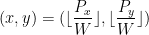

SubPixelLine
============
This is a small project which provides functions for drawing a line to a bitmap, but where the endpoints on the line are "real" values instead of the discrete pixel coordinates.

*Not actually ran with Bresenham's algorithm, I'm just showing the problem where some pixels rasterized miss the line.

Rasterizing a line with sub-pixel endpoints probably won't make much sense for a graphics library, unless doing anti-aliasing, but then you probably need a line thickness. My use case is actually for traversing a data structure, like a quadtree. When traversing a quadtree (to perform ray-tracing or something), is is important to not miss any or include extra nodes/pixels. Rasterization is used in this example for simplicity, but the algorithm can work for many different cases.

Drawing a line with [Bresenham's line algorithm](https://en.wikipedia.org/wiki/Bresenham%27s_line_algorithm) is usually the most efficient way to rasterize a line, but it usually only works if the endpoints are integer coordinates representing the center of a pixel. It doesn't allow a line to have endpoints at an arbitrary location in a pixel as shown in the image above.

I started solving this problem by abandoning Bresenham's algorithm and starting from scratch. The algorithm I have found is very similar to Bresenham's, but I arrived to it with a different approach than how it's explained on Wikipedia.
I will explain my algorithm only for the (+,+) quadrant.

  

If you start in pixel at (x,y), there are 3 possible positions for the next pixel: (x+1,y), (x,y+1), & (x+1,y+1). How do you decide which one to go to? Easy, find which side of the pixel the line intersects and go there (or diagonal if you hit the corner exactly). But line-line intersection is ugly and requires a division. My approach uses the 2D cross product defined as:

  

If this value is negative, vector b is "right" of vector a. If it's positive, b is left of vector a. If the cross product is zero, a & b point in the same direction. 

Since we want to use only integer math, its easier to think of a pixel as having a size larger than 1x1, so assume the pixel has a width W x W. Ideally, W would be a power of 2 to make modulo/division easy. The line we are given from starts at point (P.x, P.y) and goes towards point (Qx,Qy). These points are also integers, but they don't need to be multiples of W, so this gives us the ability to have sub-pixel coordinates.

  

First, you need to find which pixel coordinate (x,y) the starting point (Px,Py) lies in. This is easy (for the (+,+) quadrant):

  

For other quadrants, there are some issues, explained below in "Exactly which pixels will be drawn?"

Now you need the 2 vectors, one is the line you are given (P to Q), and another is the blue line in the images above. The blue vector points towards the (x+1,y+1) pixel. This is what you will use to determine which pixel to go to next. If the red vector (the given line) points to the right of the blue line, go to (x+1,y). If the red vector points to the left of the blue line, go to (x,y+1). If the two vectors overlapped, go diagonally to (x+1,y+1). 

[Note about confusing coordinates: in the images, it would appear as though W=1, becuase I defined the pixel coordinates as (x,y) going to (x+?,y+?). Try not to pay too much attention to the exact x,y values. We are only interested in which direction to go in each step.]

The blue vector is:

  

Now you can get the cross product value to decide which direction to go:

  

- If this value is > 0, the next pixel is (x,y+1).
- If this value is < 0, the next pixel is (x+1,y).
- If this value is exactly 0, the next pixel is (x+1,y+1).

---
Thats all you need to find where the next pixel is after the very first pixel,
but what about the rest of the pixels on the line? You can keep doing the same thing, taking the 2D cross product above, and moving pixels depending on the sign of the cross product. The starting point of these vectors will no longer be inside of the pixel, but the algorithm will still work.

  

Notice that in the green pixel, the red line is right of the blue line. This means the next pixel will be (x+1, y), which you can see is the correct pixel to go to next. Now its just a matter of optimizing the cross product calculation to avoid multiplication for every iteration. If the next pixel is to the right (x+1), then the cross product is increased by delta-x. Similarly if the next pixel is above (y+1), then the cross product is increased by delta-y:

  

Both delta variables are constants, very nice. All you have to do is add those to the cross product depending on which pixel you take every time. And that's it. Here is some psudocode of what is being done (again, only focusing on the (+,+) quadrant right now):

    int dx = x2 - x2;
    int dy = y2 - y1;
    int local_x = x1 % width;
    int local_y = y1 % width;
    int cross_product = dx*(width-local_y) - dy*(width-local_x);
    int dx_cross = -dy*width;
    int dy_cross = dx*width;

    int x = x1 / width;
    int y = y1 / width;
    int end_x = x2 / width;
    int end_y = y2 / width;
    while (x != end_x || y != end_y) {
        SetPixel(x,y,color);
        int old_cross = cross_product;
        if (old_cross >= 0) {
            x++;
            cross_product += dx_cross;
        }
        if (old_cross <= 0) {
            y++;
            cross_product += dy_cross;
        }
    }

Making this work for all quadrants involves taking some absolute values and swapping the local coordinates. I won't bother explaining the exact details, here is the code:

    int dx = x2 - x1;
    int dy = y2 - y1;
    int dx_x = (dx >= 0) ? 1 : -1;
    int dy_y = (dy >= 0) ? 1 : -1;
    int local_x = x1 % square_width;
    int local_y = y1 % square_width;
    int x_dist = (dx >= 0) ? (square_width - local_x) : (local_x);
    int y_dist = (dy >= 0) ? (square_width - local_y) : (local_y);
    int cross_product = abs(dx) * abs(y_dist) - abs(dy) * abs(x_dist);
    dx_cross = -abs(dy) * square_width;
    dy_cross = abs(dx) * square_width;

    int x = x1 / square_width;
    int y = y1 / square_width;
    int end_x = x2 / square_width;
    int end_y = y2 / square_width;

    while (x != end_x || y != end_y) {
        SetPixel(x,y,color);
        int old_cross = cross_product;
        if (old_cross >= 0) {
            x += dx_x;
            cross_product += dx_cross;
        }
        if (old_cross <= 0) {
            y += dy_y;
            cross_product += dy_cross;
        }
    }

But wait! there is still a problem...

Exactly which pixels will be drawn?
===
I need this algorithm to traverser exactly every pixel which intersects the line. The details of this are more complicated than the good old days in kindergarten where a line is "y=mx+b".

Here is a list of all possible pixel-intersections for a line directed in the (+,+) quadrant:

  

- A - If a line intersects the pixel completely, the pixel will be drawn.
- B - If a vertical line intersects the pixel completely, the pixel will be drawn.
- C - If a horizontal line intersects the pixel completely, the pixel will be drawn.
- D - If a vertical line perfectly touches the left of the pixel, the pixel will be drawn.
- E - If a horizontal line perfectly touches the bottom of the pixel, the pixel will be drawn.
- F - If a line endpoint starts inside of a pixel going (+,+), the pixel will be drawn.
- G - If a line endpoint starts exactly on the left side of a pixel going (+,+), the pixel will be drawn.
- H - If a line endpoint starts exactly on the bottom side of a pixel going (+,+), the pixel will be drawn.
- I - If a line endpoint starts exactly on the bottom left corner of a pixel going (+,+), the pixel will be drawn.

Now here is a list of possible lines which will **NOT** intersect the pixel:

  

- A' - If a line obviously doesn't intersect a pixel, the pixel will **NOT** be drawn.
- B' - If a vertical line obviously doesn't intersect a pixel, the pixel will **NOT** be drawn.
- C' - If a horizontal line obviously doesn't intersect a pixel, the pixel will **NOT** be drawn.
- D' - If a vertical line exactly touches the right side of a pixel, the pixel will **NOT** be drawn.
- E' - If a horizontal line exactly touches the top side of a pixel, the pixel will **NOT** be drawn.

- F' - If a line endpoint starts exactly on the top right corner of a pixel going in the (+,+) direction, the pixel will **NOT** be drawn.
- G' - If a line endpoint starts exactly on the top side of a pixel going in the (+,+) direction, the pixel will **NOT** be drawn.
- H' - If a line endpoint starts exactly on the right side of a pixel going in the (+,+) direction, the pixel will **NOT** be drawn.
- I' - If a line exactly *touches* a corner of the pixel, the pixel will **NOT** be drawn. This applies to **all** corners.

Those same rules apply for all the other quadrants as you would expect. There is an annoying problem you may notice for the cases where a point lines on the edge of a pixel.

  

This shows all possible starting points for a pixel with a width of 4, there are 4x4 possible
points on which the line can start.
This image is the equivalent of G' in the image of pixels that aren't drawn. The endpoint of the line drawn is at (1.25, 1.0). If you were to only look at the point (1.25, 1.0), it may seem like it belongs to the pixel, because the point floored will be (1,1) which is that pixel. But in the context of a line, it doesn't actually intersect the pixel. This caused me significant pain. The endpoint pixels being drawn cannot be assumed to be the line endpoints floored.

This behavior can be easier to understand by dropping the idea that a pixel coordinate is the line endpoint floored. Instead, for both x & y dimensions of the line, you take the range from [floor(min(x1, y2)) : ceil(max(x1, x2))] & [floor(min(x1, y2)) : ceil(max(x1, x2))] for pixel coordinates.

    int dx = x2 - x1;
    int dy = y2 - y1;
    int dx_x = (dx >= 0) ? 1 : -1;
    int dy_y = (dy >= 0) ? 1 : -1;
    int local_x = x1 % square_width;
    int local_y = y1 % square_width;
    int x_dist = (dx >= 0) ? (square_width - local_x) : (local_x);
    int y_dist = (dy >= 0) ? (square_width - local_y) : (local_y);
    int cross_product = abs(dx) * abs(y_dist) - abs(dy) * abs(x_dist);
    dx_cross = -abs(dy) * square_width;
    dy_cross = abs(dx) * square_width;

    int x = x1 / square_width;
    int y = y1 / square_width;
    int end_x = x2 / square_width;
    int end_y = y2 / square_width;

    // Perform ceiling/flooring of the pixel endpoints
    if (dy < 0)
    {
        if ((y1 % square_width) == 0)
        {
            y--;
            cross_product += dy_cross;
        }
    }
    else if (dy > 0)
    {
        if ((y2 % square_width) == 0)
            end_y--;
    }

    if (dx < 0)
    {
        if ((x1 % square_width) == 0)
        {
            x--;
            cross_product += dx_cross;
        }
    }
    else if (dx > 0)
    {
        if ((x2 % square_width) == 0)
            end_x--;
    }

    while (x != end_x || y != end_y) {
        SetPixel(x,y,color);
        int old_cross = cross_product;
        if (old_cross >= 0) {
            x += dx_x;
            cross_product += dx_cross;
        }
        if (old_cross <= 0) {
            y += dy_y;
            cross_product += dy_cross;
        }
    }

The new addition is the set of if statements above the while loop. These perform the proper ceiling/flooring of the pixel endpoints. The point still traverses from the endpoint defined by (x1,y1) going towards (x2,y2). There is no swapping depending on the quadrants of the line.

This algorithm has been tested to be recursive, meaning in a line drawn over a grid of 2x2 pixels, and the same line drawn over a grid of 4x4 pixels, the grid of 4x4 pixels will always overlap the grid of 2x2 pixels. There will be no missing or extra pixels depending on the size.

  

